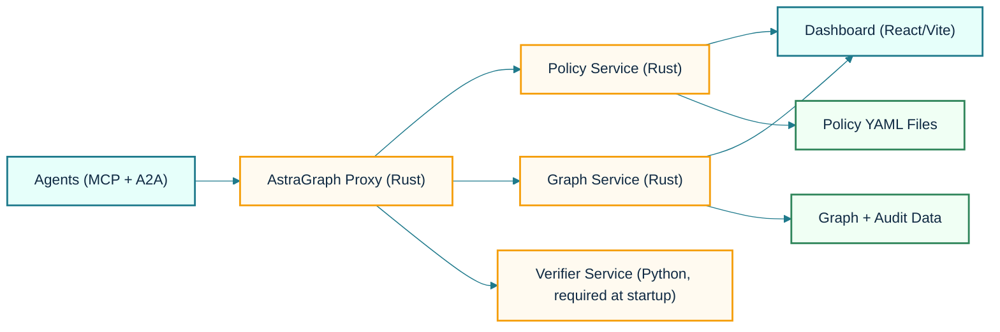
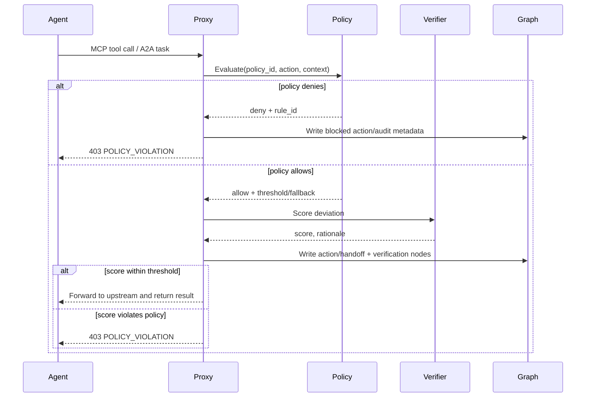

# AstraGraph

Policy-enforced observability for tool-using, multi-agent systems.

AstraGraph sits in front of MCP and A2A traffic, evaluates every action against policy, and writes a causal graph plus audit trail you can query in real time.

[](https://github.com/yagna-1/astragraph/actions/workflows/ci.yaml)
[](https://www.rust-lang.org/)
[](https://www.python.org/)
[](dashboard/)
[](LICENSE)

## Why AstraGraph

- **Prevent unsafe tool calls before execution** with fail-closed enforcement.
- **Reconstruct who did what and why** as a causal coordination graph.
- **Investigate violations fast** with searchable audit records and workflow-level traces.
- **Support multi-agent workflows** where MCP and A2A interactions mix in one run.

## System Architecture



## Request Decision Flow



## Quickstart (10 Minutes)

### Prerequisites

- Docker Desktop
- Python 3.11+ (3.12+ recommended)
- `make`
- Rust toolchain (only needed for local non-container runs)

### Run the 3-Agent E2E Gate

From this directory:

```bash
./scripts/e2e_run.sh
```

To run E2E with the real verifier service path instead of the deterministic mock:

```bash
./scripts/e2e_run.sh --real-verifier
```

The script:

1. Generates local TLS certs (`make certs`)
2. Starts core services + 3 fixture agents via Docker Compose
3. Runs `scripts/e2e_three_agent_gate.py`
4. Tears everything down

Expected final output:

```json
{"workflow_id":"wf-three-agent-e2e","status":"pass", ...}
```

## What the E2E Gate Proves

The gate validates all core controls in one run:

- A2A task handoff succeeds (`/a2a/tasks/send`)
- Safe MCP tool call is allowed (`safe_tool`)
- Risky tool call is blocked (`export_data` -> `403 POLICY_VIOLATION`)
- Block reason includes policy rule (`rule-export-block`)
- Graph store contains both allowed + blocked action nodes
- Audit endpoint returns a persisted violation record

## Local Development

### Start full stack

```bash
docker compose up --build
```

### Useful make targets

```bash
make certs
make dev-test
make dev-dashboard
make proto-gen
cargo test -p astragraph-policy policy_regression_packs_pass
```

### Policy simulation CLI (what-if decisions)

Single scenario:

```bash
cargo run -p astragraph-policy --bin policy_simulator -- \
  --policy policies/e2e-policy.yaml \
  --agent lead-scorer \
  --tool export_data \
  --args '{"table":"customers"}' \
  --now-utc "10:30 UTC"
```

Regression pack:

```bash
cargo run -p astragraph-policy --bin policy_simulator -- \
  --pack tests/policy_regressions/finance_guardrails.yaml --strict
```

### Dashboard

By default:

- URL: `http://localhost:5173`
- Graph API base: `http://localhost:8080` (override with `VITE_GRAPH_API`)

## Core APIs

Graph service (`:8080`, requires `Authorization: Bearer <token>`):

- `GET /graphs`
- `GET /graphs/:id`
- `GET /graphs/:id/nodes`
- `GET /graphs/:id/drift-path/:node_id`
- `GET /audit/violations`
- `GET /audit/violations/:id`

Policy service (`:8081`, requires bearer token):

- `GET /policies`
- `GET /policies/:name`
- `POST /policies/validate`
- `GET /policies/:name/history`
- `GET /policies/:name/rollout`
- `POST /policies/:name/rollout` (start/update canary rollout)
- `POST /policies/:name/rollout/promote` (promote candidate to stable)
- `POST /policies/:name/rollback` (rollback active rollout)

Proxy HTTP entrypoint (`:7070`):

- `POST /mcp/tools/call`
- `POST /a2a/tasks/send`

## Example API Calls

```bash
curl -H "Authorization: Bearer dev-token" \
  http://localhost:8080/graphs
```

```bash
curl -H "Authorization: Bearer dev-token" \
  "http://localhost:8080/audit/violations?workflow_id=wf-three-agent-e2e"
```

```bash
curl -X POST -H "Authorization: Bearer dev-token" -H "Content-Type: application/json" \
  "http://localhost:8081/policies/e2e-policy/rollout" \
  -d '{"percentage":20,"yaml":"apiVersion: astragraph.io/v1\nkind: AgentPolicy\nmetadata:\n  name: e2e-policy\n  version: \"1.1\"\n  owner: \"astragraph-dev@local\"\nspec:\n  agents:\n    - name: lead-scorer\n      tier: 3\n      allowed_tools: [safe_tool, export_data, a2a.tasks.send]\n      blocked_tools: []\n  rules:\n    - id: rule-export-block\n      description: Block export_data in e2e gate\n      condition: \"action.tool == export_data\"\n      action: BLOCK\n  verification:\n    threshold: 0.7\n    model: \"mock-verifier\"\n    fallback: ALLOW\n"}'
```

```bash
curl -X POST -H "Authorization: Bearer dev-token" \
  "http://localhost:8081/policies/e2e-policy/rollback"
```

## Rollout Metrics and Alert Hooks

- Policy service emits rollout telemetry:
  - `astragraph.policy.rollout.events.total` (labels: `policy`, `event`, `status`)
  - `astragraph.policy.rollout.active` (active rollout up/down counter by policy)
- Optional webhook hook for rollout lifecycle events:
  - `ASTRAGRAPH_POLICY_ALERT_WEBHOOK_URL`
  - `ASTRAGRAPH_POLICY_ALERT_WEBHOOK_TOKEN` (optional bearer token)
- Prometheus alert rule examples: `ops/prometheus/astragraph-policy-rollout-alerts.yaml`

## Repository Layout

- `proxy/`: Rust sidecar proxy and enforcement layer (MCP + A2A interceptors)
- `policy/`: Rust policy engine with YAML parsing and hot reload
- `graph/`: Rust graph and audit service (REST + gRPC)
- `verifier/`: Python verifier and distillation/scoring paths
- `dashboard/`: React + Vite operator UI
- `connectors/`: LangGraph, CrewAI, AutoGen adapter skeletons
- `ops/`: ops artifacts (example Prometheus rollout alert rules)
- `scripts/`: E2E gate, fixtures, mocks, cert generation
- `tests/`: integration and synthetic test assets
- `charts/`: Helm chart manifests

## Security and Operations Notes

- Default mode is intended to be fail-closed (`fail_closed = true` in `astragraph-proxy.toml`).
- Local certs in `certs/` are for development. Use managed PKI in production.
- Do not expose demo tokens or local auth settings in internet-facing deployments.

## Roadmap-Friendly Extensions

- Use `./scripts/e2e_run.sh --real-verifier` to exercise the real verifier path in E2E.
- Add organization auth provider and stricter role mapping for graph/policy APIs.
- Back graph/audit storage with durable external DB for high-volume workloads.
- Extend policy regression packs in `tests/policy_regressions/` and keep them green in CI.

## License

Apache-2.0. See `LICENSE`.
