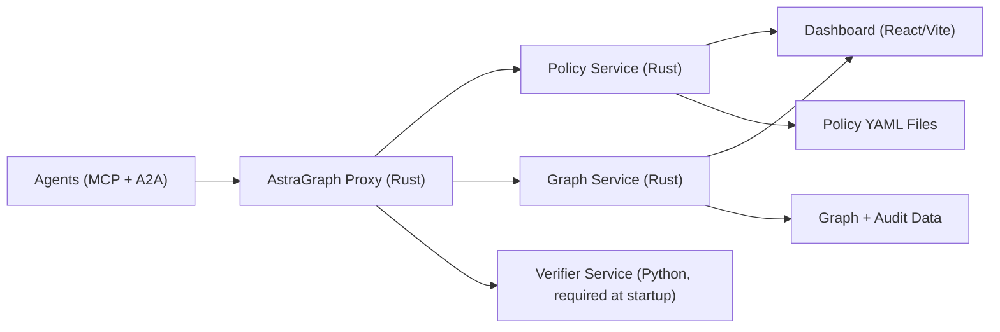
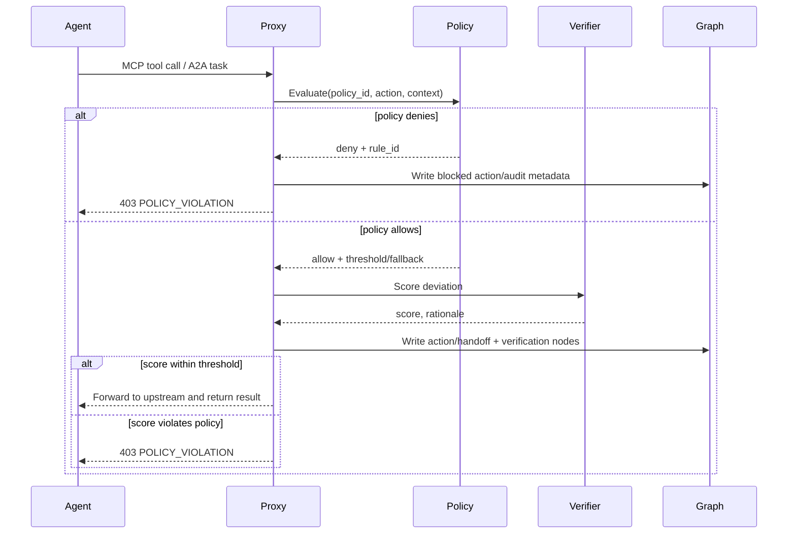

# AstraGraph

Policy-enforced observability for tool-using, multi-agent systems.

AstraGraph sits in front of MCP and A2A traffic, evaluates every action against policy, and writes a causal graph plus audit trail you can query in real time.

## Why AstraGraph

- **Prevent unsafe tool calls before execution** with fail-closed enforcement.
- **Reconstruct who did what and why** as a causal coordination graph.
- **Investigate violations fast** with searchable audit records and workflow-level traces.
- **Support multi-agent workflows** where MCP and A2A interactions mix in one run.

## System Architecture



## Request Decision Flow



## Quickstart (10 Minutes)

### Prerequisites

- Docker Desktop
- Python 3.11+ (3.12+ recommended)
- `make`
- Rust toolchain (only needed for local non-container runs)

### Run the 3-Agent E2E Gate

From this directory:

```bash
./scripts/e2e_run.sh
```

The script:

1. Generates local TLS certs (`make certs`)
2. Starts core services + 3 fixture agents via Docker Compose
3. Runs `scripts/e2e_three_agent_gate.py`
4. Tears everything down

Expected final output:

```json
{"workflow_id":"wf-three-agent-e2e","status":"pass", ...}
```

## What the E2E Gate Proves

The gate validates all core controls in one run:

- A2A task handoff succeeds (`/a2a/tasks/send`)
- Safe MCP tool call is allowed (`safe_tool`)
- Risky tool call is blocked (`export_data` -> `403 POLICY_VIOLATION`)
- Block reason includes policy rule (`rule-export-block`)
- Graph store contains both allowed + blocked action nodes
- Audit endpoint returns a persisted violation record

## Local Development

### Start full stack

```bash
docker compose up --build
```

### Useful make targets

```bash
make certs
make dev-test
make dev-dashboard
make proto-gen
```

### Dashboard

By default:

- URL: `http://localhost:5173`
- Graph API base: `http://localhost:8080` (override with `VITE_GRAPH_API`)

## Core APIs

Graph service (`:8080`, requires `Authorization: Bearer <token>`):

- `GET /graphs`
- `GET /graphs/:id`
- `GET /graphs/:id/nodes`
- `GET /graphs/:id/drift-path/:node_id`
- `GET /audit/violations`
- `GET /audit/violations/:id`

Policy service (`:8081`, requires bearer token):

- `GET /policies`
- `GET /policies/:name`
- `POST /policies/validate`
- `GET /policies/:name/history`

Proxy HTTP entrypoint (`:7070`):

- `POST /mcp/tools/call`
- `POST /a2a/tasks/send`

## Example API Calls

```bash
curl -H "Authorization: Bearer dev-token" \
  http://localhost:8080/graphs
```

```bash
curl -H "Authorization: Bearer dev-token" \
  "http://localhost:8080/audit/violations?workflow_id=wf-three-agent-e2e"
```

## Repository Layout

- `proxy/`: Rust sidecar proxy and enforcement layer (MCP + A2A interceptors)
- `policy/`: Rust policy engine with YAML parsing and hot reload
- `graph/`: Rust graph and audit service (REST + gRPC)
- `verifier/`: Python verifier and distillation/scoring paths
- `dashboard/`: React + Vite operator UI
- `scripts/`: E2E gate, fixtures, mocks, cert generation
- `tests/`: integration and synthetic test assets
- `charts/`: Helm chart manifests

## Security and Operations Notes

- Default mode is intended to be fail-closed (`fail_closed = true` in `astragraph-proxy.toml`).
- Local certs in `certs/` are for development. Use managed PKI in production.
- Do not expose demo tokens or local auth settings in internet-facing deployments.

## Roadmap-Friendly Extensions

- Replace `scripts/mock_verifier.py` with your production verifier backend.
- Add organization auth provider and stricter role mapping for graph/policy APIs.
- Back graph/audit storage with durable external DB for high-volume workloads.
- Add CI policy regression suites using the synthetic traces in `tests/synthetic/`.

## License

Apache-2.0. See `LICENSE`.
